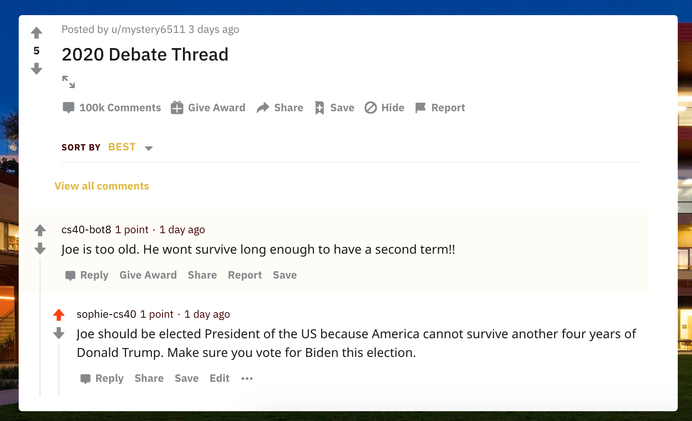

# hw03: creating a reddit bot

## candidates

my bot supports Joe Biden and opposes Donald Trump

## my favorite thread



this is one of my favorite threads involving my bot because the comment it is replying to talks about how Biden is too old and won't survive long enough to have a second term. I think it's interesting (yet coincidental) that my bot is aruging in response that the country is the one that can't survive another four years of Trump.

check it out [on Reddit](https://www.reddit.com/r/csci040temp/comments/jhb20w/2020_debate_thread/ga8eifl?utm_source=share&utm_medium=web2x&context=3)

## bot_counter.py
output of bot_counter.py file:
```code block here```

## score & tasks 

what i believe my score should be: tbd/20

list of tasks completed:

* Each task is worth 2 points. (6 tasks * 2 points/task = 12 points) +12
* The github repo is worth 2 points. +2
* Getting at least 100 comments posted is worth another 2 points. +2

* extra credit:
    * If your bot writes more than 500 comments, you get this extra credit. +1
    * Have your bot upvote any comment mentioning your favorite candidate. +1
    * Have your bot upvote any submission mentioning your favorite candidate. +1
    * Make your bot reply to highly upvoted comments before replying to lower upvoted comments. +1
    * Have your bot post new submissions to the /r/csci040 subreddit. These submissions should be from the top submissions of a political subreddit that supports your favorite presidential candidate (e.g. /r/politics or /r/conservative). Your bot must post at least 20 of these submissions to receive the extra credit. +2
    * Use the textblob library to measure the sentiment of every comment/submission... If you complete this extra credit, you also get both of the 1 point extra credits for upvoting. +2
* trying:
    * If your bot writes more than 1000 comments, you get this extra credit. +1 
    * Have the responses of your bot somehow depend on what the comment you are replying to is saying... The amount of extra credit you get for this will vary depending on the creativity of your idea. +5
 
list of tasks not completed:
* Create an army of at least 10 bots that all upvote posts according to the same criteria. This will let you manipulate which posts/comments are the most upvoted, and therefore the most read. If your bot army contains 30 bots you'll get an additional 2 points of extra credit. (+2)
* Use the GPT-2 model to generate complex political messages. (+5)


